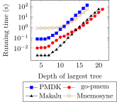
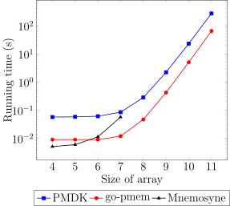
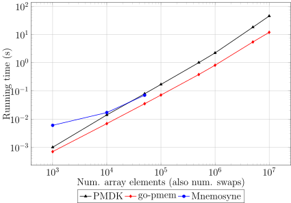
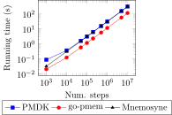
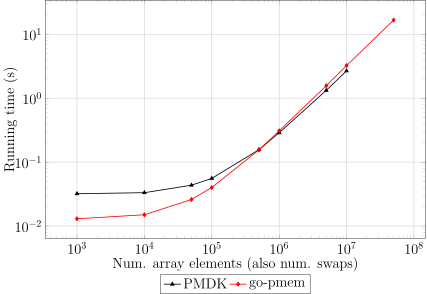
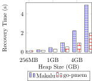
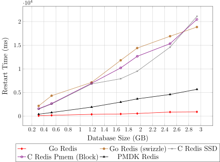
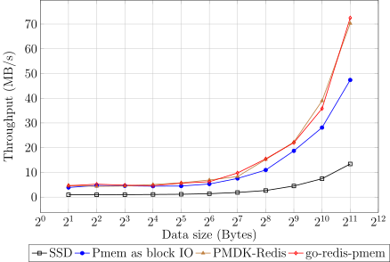

We did extensive studies comparing performance of go-pmem with other persistent
memory (pmem) libraries such as PMDK [1], Mnemosyne [2], and Makalu [3]. This
post gives a summary of the various benchmarks performed.

We use benchmarks from the Computer Language Benchmarks Game (CLBG) [4] to
compare various pmem libraries. We also compare a Redis server implemented using
go-pmem (go-redis-pmem) [8] against upstream Redis (C Redis) and also with PMDK
Redis [5].

## Machine Configuration

The experiments were run on a 24-core Intel Cascade Lake machine with 64GB of
total installed DRAM and 4 Intel® Optane™ DC Persistent memory DIMMs, each of
128 GB. The machine is running Linux 5.0.0-38-generic.

## Compilation Time Change

Our changes to the Go compiler are twofold - changes to the runtime for
persistent memory allocation support and changes to the SSA pass for automatic
instrumentation of user code for transactional support. To measure the overheads
introduced by our changes, we compared the change in compilation time of the Go
compiler before and after our changes. We also compare change in compilation
time of go-redis-pmem when compiled using the new SSA phase and using the
earlier library version of transaction package [9].

* Go compilation time increased by 3.4% from 42.71s to 44.16s
* Difference in go-redis-pmem compilation with the new SSA phase was less than
0.5% at 0.713s compared to 0.71s with the library version of transaction package.

## Performance of the Memory Allocator

To stress the persistent memory allocator, we used the Binary Tree benchmark
from CLBG. Binary Tree creates multiple perfect binary trees and reports the
time taken for the program execution. It creates one very big tree and several
trees of short depth.
<figure>

<figcaption>Fig.1: Binary Tree benchmark running time comparison (lower is better)</figcaption>
</figure>

As seen in figure 1, running time of go-pmem and Makalu are an order of magnitude
better than PMDK and Mnemosyne. This is because in PMDK and Mnemosyne,
each memory allocation result in metadata being written to persistent memory,
whereas go-pmem and Makalu write to pmem only at a larger block-level allocation.

## Performance of Transactions

### Long Running Transactions

We use the _fannkuch_ and _sps_ benchmarks to model long running transactions.
_fannkuch_ benchmark shuffles elements of an array for all n! permutations of
that array. So the number of intermediate array representations increases
exponentially as the size of the array increases. The _sps_ benchmark swaps
elements of a given array. The number of swaps performed is equal to the number
of elements in the array. These operations are all performed within a single
transaction, making it run for a long period of time.

<figure>

<figcaption>Fig.2: fannkuch benchmark running time (lower is better)</figcaption>
</figure>

<figure>

<figcaption>Fig.3: sps benchmark running time (lower is better)</figcaption>
</figure>

In the _fannkuch_ and _sps_ benchmarks (figure 2 and 3 respectively), it is seen
that the Mnemosyne curve does not scale as the transaction size grows. The PMDK
implementation also supports a maximum pmem heap size of only 2GB. The
performance go-pmem is 3 to 4 times better than PMDK as transaction size grows.

### Several Short Transactions

<figure>

<figcaption>Fig.4: n-body benchmark comparison (lower is better)</figcaption>
</figure>

The _n-body_ benchmark from CLBG is used to measure the performance of a short
transaction. In a short transaction, the transaction setup time becomes the
hotspot rather than the transaction execution. _n-body_ benchmark models the
movement of a planet, and each step is performed transactionally. Each step
computes the new coordinates representing the position of a planet as it moves
in an orbit. As seen in
figure 4, go-pmem performs 2 to 3 times better than PMDK and Mnemosyne even as
the number of steps in the benchmark reaches 10 million.

## Restart Time Comparison

### Undo Transaction Recovery After a Crash

<figure>

<figcaption>Fig.5: Transaction recovery time comparison (lower is better)</figcaption>
</figure>

We reuse the _sps_ benchmark to measure the transaction recovery time in case
of an application crash. The _sps_ benchmark swaps the elements of an array. We
induce an application crash at the last array element swap and measure the
transaction recovery time. go-pmem performs much better than PMDK when the
amount of data to recover is small, but slows down to about 20% as compared to
PMDK when the amount of data increases. The transaction recovery codepath is
not highly optimized in go-pmem at the moment as we expect application crashes
to be rare. Nevertheless, optimizing transaction recovery is part of our future
goals.

### Restart Time of Persistent Heaps

<figure>

<figcaption>Fig.6: Heap recovery time comparison (lower is better)</figcaption>
</figure>

The _fill-heap_ benchmark from Makalu [3] is used to measure the heap recovery
time of various pmem libraries. _fill-heap_ creates 64-byte objects in the pmem
heap to fill it up to a specified size. Half of these objects are made reachable
from the root objects. On restarting this benchmark application, we measure the
time taken to recover the pmem heap. go-pmem is able to recover the pmem heap much
faster than Makalu. This is because Makalu has to go through an expensive offline
garbage collection phase before it can recover the pmem heap. The PMDK graph is
not shown in the benchmark, as it restarts almost instantaneously irrespective
of the heap size.

### Restart Time of Redis Variations

<figure>

<figcaption>Fig.7: Restart time of various Redis versions (lower is better)</figcaption>
</figure>

Figure 7 compares the restart time of various redis versions - C Redis running
on SSD, C Redis running on pmem used as block I/O, PMDK Redis, and Go Redis.
PMDK Redis and Go Redis are hand-modified versions of Redis designed for pmem.
Go Redis Swizzle measures the cost of swizzling pointers when pmem arenas are
mapped at a different address than where it was originally mapped. C Redis
persists its data as an Append Only File (AOF) file.

## Go Benchmarks

| Benchmark  | Upstream | go-pmem | delta |
|------------|----------|---------|-------|
| Build-24   | 23.9s    | 23.9s   | 0%    |
| Garbage-64 | 23.4ms   | 23.6ms  | 0.87% |
| JSON-24    | 84.0ms   | 84.3ms  | 0.44% |
| HTTP-24    | 73.9μs   | 75.5μs  | 2.15% |

Go uses a set of benchmarks [6] to measure the performance of the compiler,
allocator, garbage collector, etc. after new features are added to the language.
The above table compares how these benchmarks fare on go-pmem compared to Go
1.11 upon which our changes are based on. Our changes add little-to-no
performance difference.

## Go-redis-pmem

<figure>

<figcaption>Fig.8: Memtier benchmark throughput comparison on various Redis versions (higher is better)</figcaption>
</figure>

Figure 8 compares the throughput observed when memtier benchmark [7] is run
on the following Redis versions - C Redis running on SSD, C Redis running on
pmem used in block I/O mode, PMDK Redis, and go-redis-pmem. It is seen that
go-redis-pmem throughput matches the performance of PMDK Redis. It performs up
to 53% better than Redis using pmem as block I/O and up to 5.4x better than Redis
using SSD. This confirms that applications hand-modified to use pmem gets
maximum performance benefits, compared to pmem used as block I/O and SSDs.

The memtier benchmark configuration used is the following:
Num. threads = 12
Num. clients = 1
R:W ratio = 3:7
Num. requests per client = 100000
Key-pattern = S:S
Pipeline = 1

## References

1. Persistent memory development kit. [https://pmem.io/pmdk/](https://pmem.io/pmdk/).
2. Haris Volos, Andres Jaan Tack, and Michael M Swift. Mnemosyne: Lightweight persistent memory. In ACM SIGARCH Computer Architecture News, volume 39, pages 91–104. ACM, 2011.
3. Kumud Bhandari, Dhruva R Chakrabarti, and Hans-J Boehm. Makalu: Fast recoverable allocation of nonvolatile memory. In ACM SIGPLAN Notices, volume 51, pages 677–694. ACM, 2016.
4. Fulgham, Brent, and Isaac Gouy. "The computer language benchmarks game." (2009).
5. Intel corporation. pmem-redis. https://github.com/pmem/redis.
6. Golang benchmarks. https://github.com/golang/benchmarks/.
7. Redis labs. redis and memcached traffic generation and benchmarking tool. https://github.com/RedisLabs/memtier_benchmark.
8. go-redis-pmem. https://github.com/vmware-samples/go-redis-pmem
9. go-pmem-transaction. https://github.com/vmware/go-pmem-transaction
