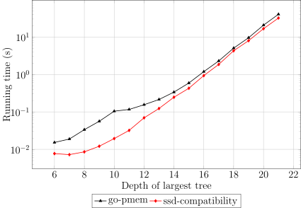
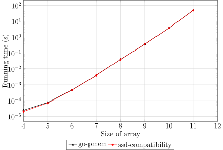
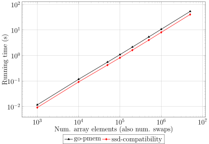

The block device compatibility layer of *go-pmem* was developed so that
our package can be used even on those machines without persistent memory (pmem).

This layer provides weaker consistency guarantee than *go-pmem* running on
persistent memory, but lets developers use and test our package on machines
which has only block I/O storage. The weaker consistency guarantees offered by
this compatibility layer are the following:
* it is resilient to application crashes or restarts
* in case of a host crash or restart, data can get irrecoverably corrupted

## Innards

To ensure writes to a pmem device is made persistent, *go-pmem* issues cache
flushing and memory barrier instructions as required. But if the file passed to
```pmem.Init()``` function resides in a block I/O device, then an ```msync()```
system call has to be issued to ensure data writes are persistent. ```msync()```
flushes to disk data at a page granularity. Therefore, issuing ```msync()``` for
byte-level data updates leads to write-amplification and significant slowdown
of applications. To offer a reduced consistency guarantee to applications,
but at the same time let them use our package on a machine without pmem, we
developed a compatibility layer to *go-pmem*. If *go-pmem* identifies that the
pmem file resides on a block I/O device, no explicit ```msync()``` is issued to
ensure data persistence. Instead, we rely on the kernel to periodically flush
dirty data from the DRAM to disk. Dirty data is also flushed, by the operating
system, to persistent media when the application exits or crashes. But if the
host machine abruptly loses power or is restarted, then there is no guarantee
that dirty data would have been synced to disk. This is the reason for the
reduced consistency guarantee offered in this compatibility mode.

## Usage

The compatibility layer is automatically enabled if the file passed to
```pmem.Init()``` is detected to reside in a block I/O device. There is no
change in the programming model to enable this functionality. Following is an
example program that uses this compatibility mode:

```go
package main

import (
	"github.com/vmware/go-pmem-transaction/pmem"
	"github.com/vmware/go-pmem-transaction/transaction"
)

type data struct {
	val *int
}

var ptr *data

func main() {
	pmem.Init("./datafile") // assuming block I/O device
	ptr = (*data)(pmem.Get("root", ptr))
	if ptr == nil {
		ptr = (*data)(pmem.New("root", ptr))
	}
	if ptr.val == nil {
		txn("undo") {
			ptr.val = pnew(int)
			*ptr.val = 42
		}
	} else {
		println("Value is ", *ptr.val)
	}
}
```

## Performance

When an application `mmap`'s a file residing in a block device, reads and writes
first happen to the copy of the data in DRAM. Dirty data is flushed to the disk
in a periodic interval by the kernel and also on the explicit invocation of an
`msync()` system call. Since data read and write is served from the DRAM,
applications using this compatibility layer of *go-pmem* will observe faster
performance than applications running on pmem. This is because the read/write
latency of DRAM is lower than that of pmem. To observe this performance
difference, we compared the CLBG suite of benchmarks and SPS benchmark running
on pmem and SSD. The following graphs shows this data.

1\. binarytree benchmark from CLBG

<figure>

<figcaption>Fig. 1: Binary Tree benchmark running time comparison (lower is better)</figcaption>
</figure>

2\. fannkuch benchmark from CLBG

<figure>

<figcaption>Fig. 2: fannkuch benchmark running time (lower is better)</figcaption>
</figure>

3\. n-body benchmark from CLBG

<figure>

<figcaption>Fig. 3: n-body benchmark comparison (lower is better)</figcaption>
</figure>

4\. SPS benchmark

<figure>

<figcaption>Fig. 4: sps benchmark running time (lower is better)</figcaption>
</figure>

## Conclusion

We hope developers interested in programming persistent memory find the block
compatibility layer of *go-pmem* useful, as it obviates the need for having
access to a pmem device. The higher performance offered by this layer lets
developers quickly prototype their solutions and even develop full-fledged pmem
applications. Once pmem hardware is available, these applications can then make
use of the new hardware by simply moving its data file to the pmem device.
